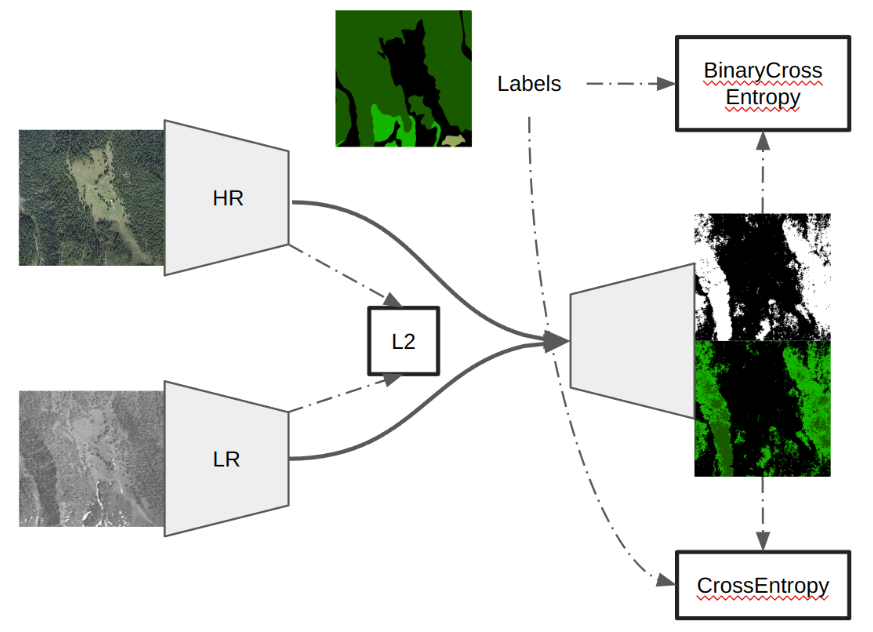
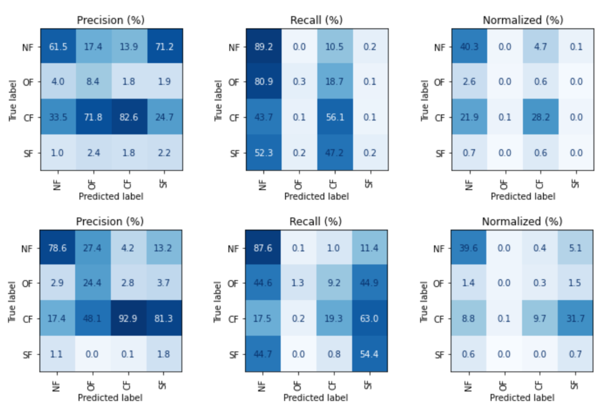
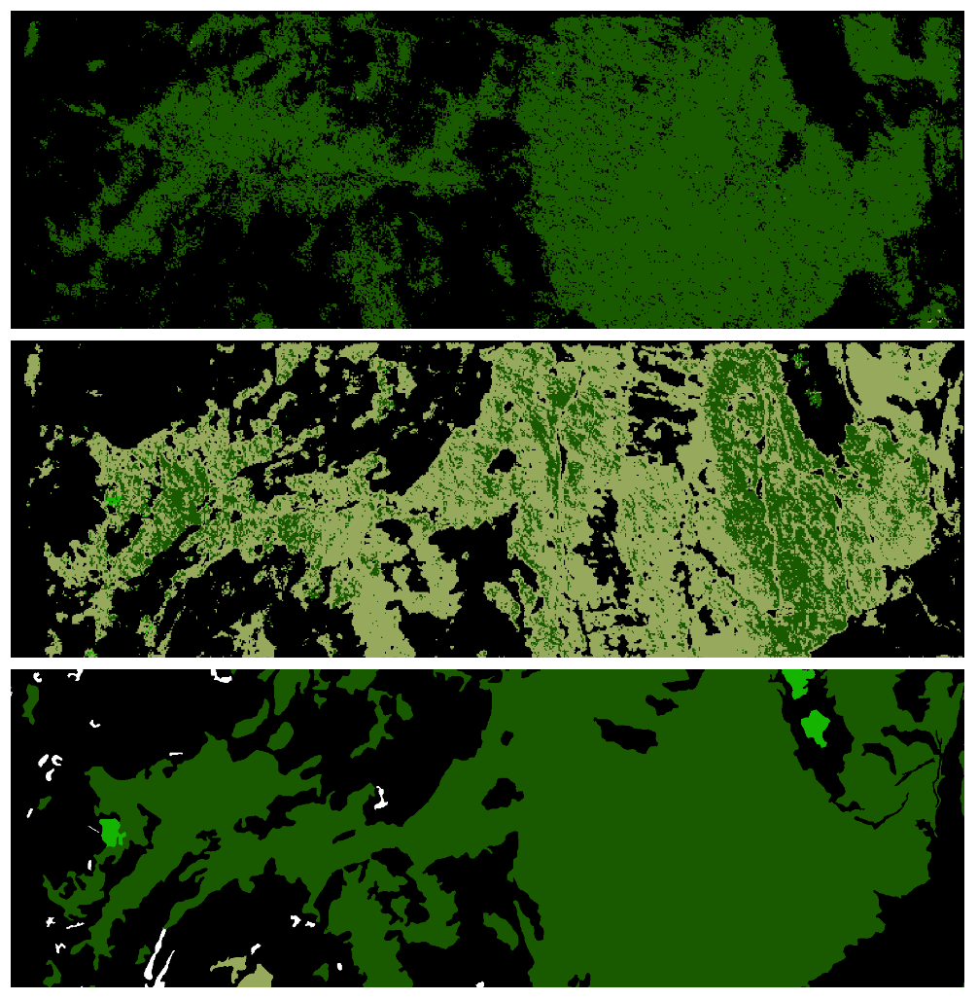
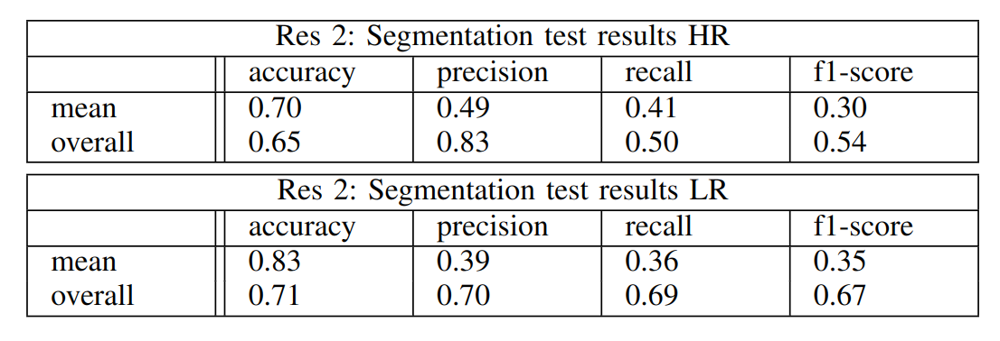

# multi-resolution-forest-mapping
Multiple U-Net encoders mapping different resolution images into the same feature space for semantic segmentation of the Forest Tree Line in the Alps. The data used is from Swisstopo.

Original code from: https://github.com/thienanhng/ForestMapping/blob/main/launch.sh

## Results (15 epochs)
HR = High Resolution encoder
LR = Low Resolution encoder

Model (HR and LR encoders mapping to the same decoder):

Confusion matrices (HR top, LR bottom):

Confusion matrices (HR top, LR middle, labels bottom):

The labels in black are No Forest, dark gray Close Forest, light gray Open Forest, beighe Shrub Forest and white woodland(neglected for the type of forest segmentation).

Results (HR top, LR bottom):

## install

    conda env create -f myenv.yml

or

    conda create -n myenv python=3.10.0

packages: gdal rasterio pandas torch torchvision tqdm numpy psutil opencv-python
    conda install -n myenv <package_name>
    conda activate myenv

## guide

Train is the training process to train the two encoders and decoder.
Infer is the validation process to evaluate the performance of the trained model.

## args

Check in infer.py and train.py the arguments for more help

## csv

in order 1946, 2017, 2017 labels:

input_0,input_1,target
/media/data/charrez/SwissIMAGE/1946/gray_DOP100_LV95_2570_1099_1946.tif,
/media/data/charrez/SwissImage/2017_25cm/DOP25_LV95_2570_1099_2017_1.tif,
/media/data/charrez/TLMRaster/5c/TLM5c_2570_1099.tif